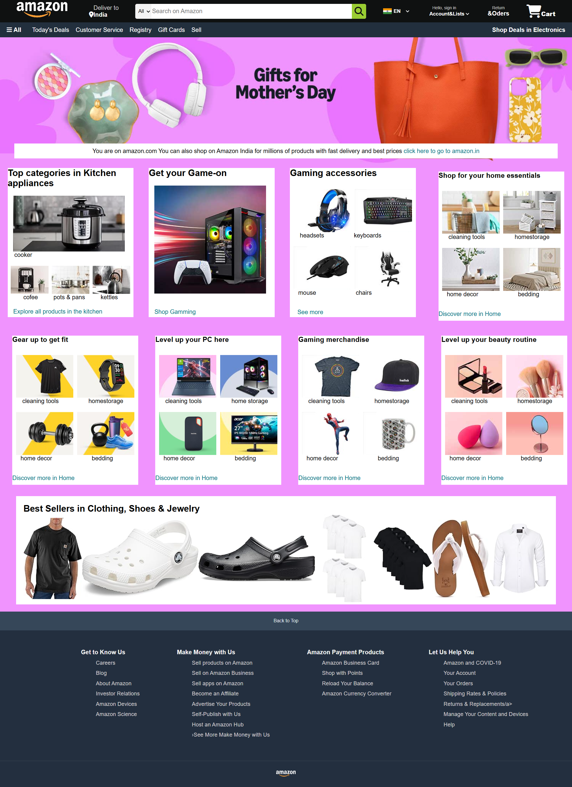

<h1 align="center">🛍 Amazon Clone Website</h1>

<p align="center">
  
  
</p>

<p align="center">
  <a href="https://anmol0240.github.io/Amazon_website/" target="_blank">
    🔗 <strong>Live Demo</strong>
  </a>
</p>

<p align="center">
  
</p>

---

## 📌 About the Project

This is a front-end clone of the Amazon website made using *HTML, CSS, and JS*. It's responsive, clean, and gives the user that real Amazon-like feel! 🚀

✅ Clone designed by: **ANMOL**

<p align="center">
  <a href="https://amazon.com" target="_blank">
    
  </a>
</p>

🔗 Live site: [Click here to visit!](https://anmol0240.github.io/Amazon_website/)

---

## 📸 Website Preview

 <!-- Replace this with your screenshot image filename -->

---

## ✨ Features

- 🧭 Navigation bar with Amazon-like layout  
- 🔍 Search bar (UI only)  
- 🛒 Product grid display  
- 📱 Responsive design basics  
- 💅 Clean and simple UI using pure HTML and CSS  

---

## 🛠 Tech Stack

- **HTML5**  
- **CSS3**  

---

## 📁 Project Structure

Amazon_website/ │ ├── index.html ├── style.css ├── images/ ├── screenshot.png └── README.md


---

## 🚀 Future Improvements

- 🛍 Add-to-cart simulation  
- 🌙 Dark mode toggle  
- 🔍 Search filtering with JavaScript  
- 📱 Enhanced responsiveness for mobile/tablet  
- 🧩 Modular JavaScript structure  

---

## 🧠 How to Use

1. Clone this repo  
   ```bash
   git clone https://github.com/anmol0240/Amazon_website.git
Open index.html in your browser

Or just visit the Live Demo

🙋‍♂️ About Me
Created by ANMOL
Frontend enthusiast passionate about clean design and smooth user experience.

<p align="left"> <a href="https://github.com/anmol0240">  </a> </p>
📬 Contact Me
<p> <a href="https://instagram.com/ft_.anmol" target="_blank">  </a> <a href="mailto:anmol.bhonsale6@gmail.com">  </a> </p>
🏁 Final Words
"Due to limited time and resources, we've simulated the static content, but we’ve architected the project in a way that it can directly integrate with real e-commerce functionalities in the future."
